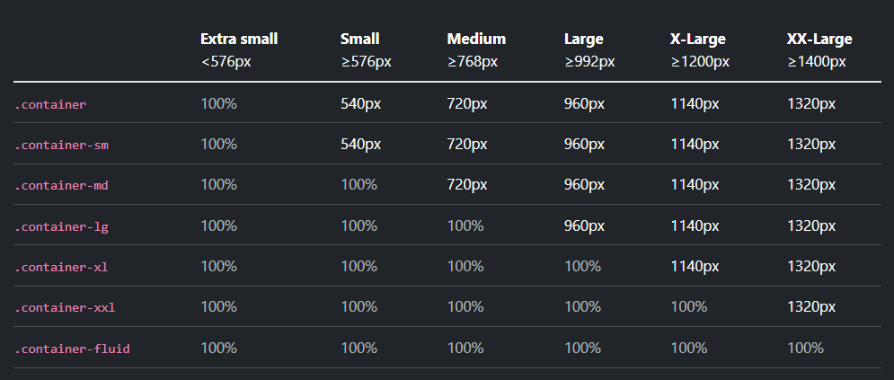

# Angular18Crud

This project was generated with [Angular CLI](https://github.com/angular/angular-cli) version 18.2.12.

## Development server

Run `ng serve` for a dev server. Navigate to `http://localhost:4200/`. The application will automatically reload if you change any of the source files.

## Code scaffolding

Run `ng generate component component-name` to generate a new component. You can also use `ng generate directive|pipe|service|class|guard|interface|enum|module`.

## Build

Run `ng build` to build the project. The build artifacts will be stored in the `dist/` directory.

## Running unit tests

Run `ng test` to execute the unit tests via [Karma](https://karma-runner.github.io).

## Running end-to-end tests

Run `ng e2e` to execute the end-to-end tests via a platform of your choice. To use this command, you need to first add a package that implements end-to-end testing capabilities.

## Further help

To get more help on the Angular CLI use `ng help` or go check out the [Angular CLI Overview and Command Reference](https://angular.dev/tools/cli) page.

## Bootstrap Documentation

Sizes => xxl xl lg ms sm xs 

xxl -> >= 1400px
xl  -> >= 1200px - 1399px
lg  -> >= 992px  - 1199px
md  -> >= 768px  - 991px
sm  -> >= 576px  - 767px
xs  -> >= opx    - 575px

## Bootstrap Containers

/* media query used to fix the size to 1150 px when min-width is greater than 1400px */
@media (min-width: 1400px) {
    .container, .container-lg, .container-md, .container-sm, .container-xl, .container-xxl {
        max-width: 1150px;
    }
}

## Botstrap Grid

